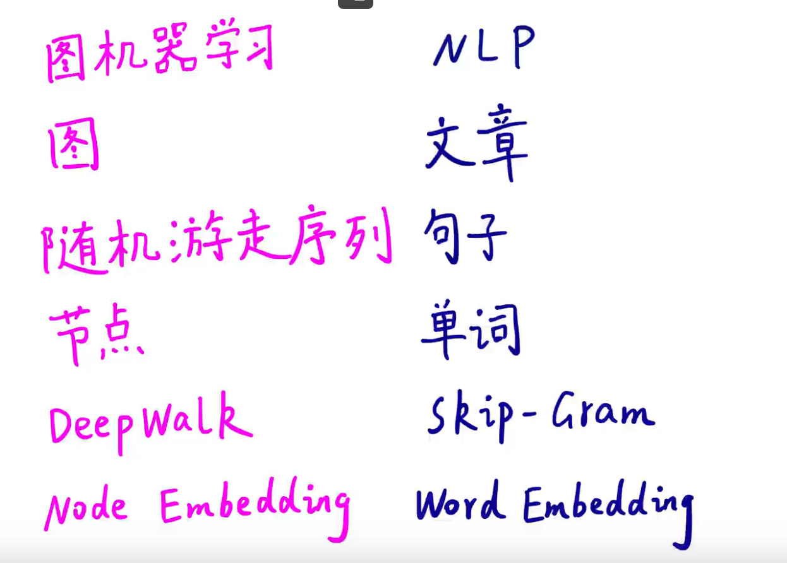

# Task04 图表示学习（图嵌入）
这里讲的还是传统的图表示学习方法，只考虑了连接特征，没有考虑节点的属性特征。
定义一个图G，V代表其节点集合，A代表其邻接矩阵。
将节点映射为d维向量的方式包括：
- 手工特征工程：例如节点重要度，graphlets等
- 图表示学习：通过随机游走构建自监督学习任务，包括Deepwalk、Node2Vec等
- 矩阵分解：上述的基于随机游走的图表示学习方法，可以统一成矩阵分解的形式
- 深度学习：图神经网络、图卷积神经网络等

## 一、图表示学习概述
### 1.特点
通过图表示学习所映射出的向量具有如下特征
- 低维：向量的维度远小于图节点的个数
- 连续：每个元素都是实数
- 稠密：每个元素都不为0

### 2.基本框架
编码器-解码器结构
- 编码器：输入一个节点，输出节点的的d维向量
- 解码器：对两个d维向量做点乘，得到的就是一个标量，即向量的余弦相似度，这个值应该要能够反映出两个节点的相似度。目标是使得相似度大的节点其向量的点乘积也大

## 二、编码器
编码器分为浅编码器和深编码器
- 浅编码器：最简单的方法就是查表
- 深编码器：图神经网络

### 1.浅编码器概念
形式为： $ENC(v)=z_v=Z\cdot v$
其中 $Z\in R^{d\times|V|}$ ，就是图中所有节点的d维向量形成的矩阵，行数是d，列数是节点的个数。而 $v$ 是一个one-hot向量，只有需要取的那一列对应的行为1，其他都为0。
DeepWalk、Node2Vec都是浅编码器。这是一个无监督学习/自监督学习的问题，因为没有使用节点类别标签和节点属性特征，直接优化嵌入向量。并且与下游的任务无关（但是学习好的结果可以用于下游任务）

### 2.图嵌入与自然语言处理的关系

### 3.DeepWalk
有点像dfs。
定义：
- 向量 $Z_u$ : 就是节点u的向量，也是我们要找到的
- 概率 $P(v|z_u)$ : 从u节点出发的随机游走序列经过v节点的概率

如何计算这个概率：
- softmax函数
- sigmoid函数
