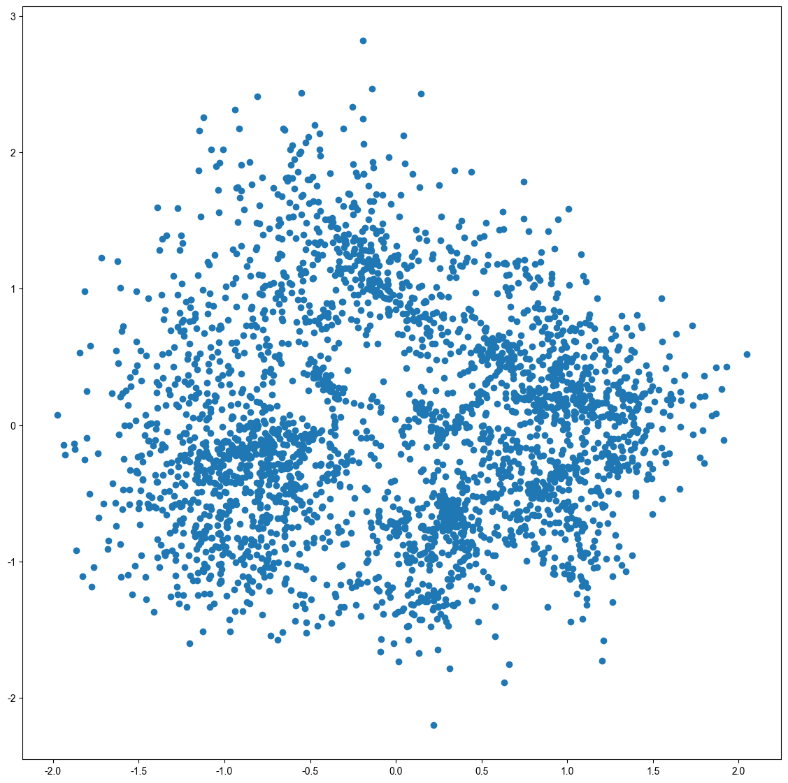
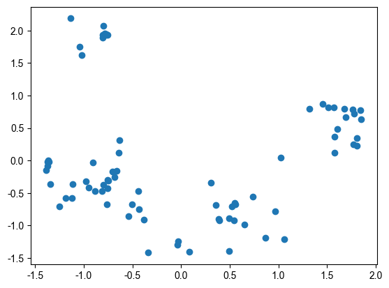

# Task05 DeepWalk和Node2Vec
这里把所有公式都去掉了，只保留了简单的流程，因为我自己也没太搞明白公式，但是写代码的时候知道流程也就足够了，等我搞明白了这些公式细节再把公式加上。
## 一、DeepWalk
### 1. 算法简介
实现图嵌入，即将Graph的每一个节点编码成一个D维向量，学到的是图的连接结构信息，**没有利用到节点自身的属性信息**。

### 2.母算法 - Word2Vec
- CBOW：输入周围词，预测中心词
- Skip-Gram：输入中心词，预测周围词

### 3.随机游走
deepwalk假设相邻节点是相似的，假设一个醉汉在节点中游走，对每个节点都生成一个随机游走的序列。

**这里和DFS不一样，这里走到每个节点的下一步的方向完全是随机的，也可以往回走，而DFS不会。**

### 4.算法步骤
1. 输入图
2. 以每个节点为起点都随机游走，每个节点得到 $\gamma$条 随机游走序列，每个随机游走序列的最大长度为 $t$ 。
3. 用随机游走序列去训练Word2Vec。这里是构造Skip-Gram任务，输入的序列作为中心词，预测周围的词。
4. 使用Softmax（霍夫曼编码树）解决分类个数过多的问题
5. 得到节点的图嵌入向量表示

### 5.代码实战
```python
import networkx as nx
import pandas as pd
import numpy as np
import random
from tqdm import tqdm
import matplotlib.pyplot as plt
%matplotlib inline
plt.rcParams['font.sans-serif']=['Arial Unicode MS']  # 用来正常显示中文标签  
plt.rcParams['axes.unicode_minus']=False  # 用来正常显示负号
```


```python
df = pd.read_csv("seealsology-data.tsv", sep="\t")
df.head()
```


<div>
<style scoped>
    .dataframe tbody tr th:only-of-type {
        vertical-align: middle;
    }

    .dataframe tbody tr th {
        vertical-align: top;
    }

    .dataframe thead th {
        text-align: right;
    }
</style>
<table border="1" class="dataframe">
  <thead>
    <tr style="text-align: right;">
      <th></th>
      <th>source</th>
      <th>target</th>
      <th>depth</th>
    </tr>
  </thead>
  <tbody>
    <tr>
      <th>0</th>
      <td>support-vector machine</td>
      <td>in situ adaptive tabulation</td>
      <td>1</td>
    </tr>
    <tr>
      <th>1</th>
      <td>support-vector machine</td>
      <td>kernel machines</td>
      <td>1</td>
    </tr>
    <tr>
      <th>2</th>
      <td>support-vector machine</td>
      <td>fisher kernel</td>
      <td>1</td>
    </tr>
    <tr>
      <th>3</th>
      <td>support-vector machine</td>
      <td>platt scaling</td>
      <td>1</td>
    </tr>
    <tr>
      <th>4</th>
      <td>support-vector machine</td>
      <td>polynomial kernel</td>
      <td>1</td>
    </tr>
  </tbody>
</table>
</div>


```python
df.shape
```


    (4667, 3)


#### 创建无向图


```python
G = nx.from_pandas_edgelist(df, "source", "target", edge_attr=True, create_using=nx.Graph())
```


```python
?nx.from_pandas_edgelist
```


```python
len(G)
```


    3054


#### 可视化


```python
plt.figure(figsize=(55,54))
nx.draw(G, with_labels=True)
plt.show()
```


    

    


```python
# 生成随机游走节点序列的函数
def get_randomwalk(node, path_length):
    '''
    输入起始节点和路径长度，生成随机游走序列
    '''
    random_walk = [node] # 输入的是起始节点
    for i in range(path_length - 1):
        # 汇总邻接节点
        temp = list(G.neighbors(node))
        temp = list(set(temp) - set(random_walk))
        if len(temp) == 0:
            break
        # 从邻接节点中随机选择下一个节点
        random_node = random.choice(temp)
        random_walk.append(random_node)
        node = random_node
    return random_walk
```


```python
all_nodes = list(G.nodes)
all_nodes
```


    ['support-vector machine',
     'in situ adaptive tabulation',
     'kernel machines',
     'fisher kernel',
     'platt scaling',
     'polynomial kernel',
     'predictive analytics',
     'regularization perspectives on support vector machines',
     'relevance vector machine',
     'sequential minimal optimization',
     ...]


```python
get_randomwalk('neural decoding', 5)
```


    ['neural decoding',
     'bursting',
     'information theory',
     'computational neuroscience',
     'connectomics']


#### 生成随机游走序列


```python
gamma = 10 # 每个节点作为起点生成的随机游走序列的个数
walk_length = 5 # 随机游走序列的最大长度

random_walks = []
for n in tqdm(all_nodes):
    for i in range(gamma):
        random_walks.append(get_randomwalk(n, walk_length))
```

    100%|██████████████████████████████████████| 3054/3054 [00:00<00:00, 23546.09it/s]


```python
len(random_walks)
```


    30540


#### 训练word2vec模型


```python
from gensim.models import Word2Vec # 自然语言处理
model = Word2Vec(vector_size=256, #Embedding的维度数，也就是输出的向量有多少维度，高维度可以表示更多信息
                 window=4, #窗口宽度，即用中间预测两边时候那个窗口多大(左边4右边4)
                 sg=1, #skip-gram（中间预测两边，如果是两边预测中间这里应该为0）
                 hs=0, #不加分层softmax
                 negative=10, #负采样
                 alpha=0.03, #初始学习率
                 min_alpha=0.0007, #最小学习率
                 seed=14 #随机种子
                )

```


```python
model.build_vocab(random_walks, progress_per=2) #用随机游走序列构建词汇表
```


```python
model.train(random_walks, total_examples=model.corpus_count, epochs=10, report_delay=1) # 训练
```


    (1139830, 1153930)


#### 分析结果


```python
#查看某个节点的embedding
model.wv.get_vector('neural decoding').shape
```


    (256,)


```python
model.wv.get_vector('neural decoding')
```


    array([ 0.02073619,  0.10833947, -0.27300033,  0.1741582 ,  0.75308   ,
           -0.13530019,  0.3479293 ,  0.15243661,  0.52507955,  0.13263133,
            ... ], dtype=float32)


```python
#找相似的词语
model.wv.similar_by_word('decision tree')
```


    [('topological combinatorics', 0.9546914100646973),
     ('truth table', 0.9518890976905823),
     ('markov chain', 0.9499955177307129),
     ('ordinal priority approach', 0.9453429579734802),
     ('drakon', 0.9443473219871521),
     ('random forest', 0.9438090324401855),
     ('design rationale', 0.9422404766082764),
     ('decision tree model', 0.9364842176437378),
     ('decision list', 0.9361652731895447),
     ('odds algorithm', 0.9356186389923096)]


#### PCA降维可视化


```python
from sklearn.decomposition import PCA
X = model.wv.vectors
pca = PCA(n_components=2)
embed_2d = pca.fit_transform(X)
embed_2d.shape
```


    (3054, 2)


```python
plt.figure(figsize=(14,14))
plt.scatter(embed_2d[:, 0], embed_2d[:, 1])
plt.show()
```


    

    


#### 可视化某个词条的二维embedding


```python
term = 'computer vision'
term_256d = model.wv[term].reshape(1, -1) # model.wv[term]的到的是行向量，维度为(256,)，所以需要reshape
term_256d.shape
```


    (1, 256)


```python
term_2d = pca.transform(term_256d)
term_2d
```


    array([[-0.6813402,  1.5101489]], dtype=float32)


```python
plt.figure(figsize=(14,14))
plt.scatter(embed_2d[:, 0], embed_2d[:, 1])
plt.scatter(term_2d[:, 0], term_2d[:, 1], c='r', s=200)
plt.show()
```


    

    


#### 可视化某些词条的二维embedding


```python
#计算pagerank重要度
pagerank = nx.pagerank(G)
# 从高到低排序
node_importance = sorted(pagerank.items(), key=lambda x: x[1], reverse=True)
#取最高的30个节点
n = 30
terms_chosen = []
for each in node_importance[:n]:
    terms_chosen.append(each[0])
# 手动补充新节点
terms_chosen.extend(['computer vision'])
terms_chosen
```


    ['graph theory',
     'collective intelligence',
     'evolutionary psychology',
     ...}


```python
# 可视化全部词条和关键词条的二维embedding
plt.figure(figsize=(14,14))
plt.scatter(embed_2d[:, 0], embed_2d[:, 1])

for item in terms_chosen:
    idx = terms2index[item]
    plt.scatter(embed_2d[idx, 0], embed_2d[idx, 1], c='r', s=50)
    plt.annotate(item, xy=(embed_2d[idx, 0], embed_2d[idx, 1]), c='k', fontsize=12)
plt.show()
```


    

    


#### 使用TSNE降维算法


```python
# 可视化全部词条
from sklearn.manifold import TSNE
tsne = TSNE(n_components=2, n_iter=1000)
embed_2d = tsne.fit_transform(X)
print(embed_2d)
plt.figure(figsize=(14, 14))
plt.scatter(embed_2d[:, 0], embed_2d[:, 1])
plt.show()
```

    [[  6.923845   -64.0972    ]
     [-32.579193    -8.005825  ]
     [-41.00802     -4.38229   ]
     ...
     [-26.224298     6.796098  ]
     [  0.93235034 -12.263934  ]
     [  3.8483002   -7.892991  ]]


    

    


```python

```

## 二、Node2Vec
在DeepWalk完全随机游走的基础上，Node2Vec增加参数p和q，实现有偏随机游走。不同的p、q组合，对应了不同的探索范围和节点语义，还可以用于连接预测。DeepWalk是Node2Vec在p=1，q=1的特例。
### 1. DeepWalk的缺点
用完全随机游走，训练节点嵌入向量，仅能反映相邻节点的社群相似信息，无法反映节点的功能角色相似信息（缺失了采样策略，无法进行调整）。
### 2.Node2Vec的特点
- Node2Vec是有偏的随机游走，属于二阶随机游走（二阶马尔科夫），取决于当前点的位置和上一个节点：
    - 当$\displaystyle \alpha=\frac{1}{p}$时，当前节点返回上一个节点
    - 当$\alpha = 1$时，当前节点徘徊
    - 当$\displaystyle \alpha = \frac{1}{q}$时，当前节点远行

- 当$p$值很小时，属于广度优先搜索，反映微观的邻域，发掘节点功能角色
- 当$q$值很小时，属于深度优先搜索，反映宏观的视角，发掘同质社群
### 3.Node2Vec的步骤
1. 每个节点生成r个随机游走序列，即生成训练集
2. 使用上述训练集，输入到Word2Vec，通过Skip-Gram训练得到节点嵌入表示

在Node2Vec中有两个很重要的假设：
- 假设周围节点互不影响
- 假设两个节点之间的互相影响的程度一样

### 4.代码实战
```python
import networkx as nx # 图数据挖掘
import numpy as np # 数据分析
import random # 随机数
import matplotlib.pyplot as plt # 数据可视化
%matplotlib inline
plt.rcParams['font.sans-serif']=['Arial Unicode MS']  # 用来正常显示中文标签  
plt.rcParams['axes.unicode_minus']=False  # 用来正常显示负号
```

#### 导入数据集


```python
# 悲惨世界人物数据集
G = nx.les_miserables_graph()
```


```python
print(G.nodes)
print(len(G))
```

    ['Napoleon', 'Myriel', 'MlleBaptistine', 'MmeMagloire', 'CountessDeLo', ...]
    77


```python
# 数据集可视化
plt.figure(figsize=(15, 14))
pos = nx.spring_layout(G, seed=5)
nx.draw(G, pos, with_labels=True)
plt.show()
```


    

    


#### 构建Node2Vec模型


```python
from node2vec import Node2Vec
#设置node2vec参数
node2vec = Node2Vec(G,
                   dimensions=32, #输出的嵌入向量维度
                   p=2, #回家参数
                   q=0.5, #外出参数
                   walk_length=3, #随机游走的最大长度
                   num_walks=600, #每个节点作为起始节点生成的随机游走个数，论文中的r
                   workers=4 #并行线程数
                   )

'''
论文中给出了：
p=1，q=0.5，n_clusters=6，是DFS深度优先搜索，挖掘同质社群
p=1，q=2，n_clusters=3，是BFS广度优先搜索，挖掘节点的结构功能角色
'''

#训练node2vec
model = node2vec.fit(window=3, #skip-gram窗口的大小
                    min_count=1, #忽略出现次数低于此阈值的节点（词）
                    batch_words=4 #每个线程处理的数据量
                    )
X = model.wv.vectors #就是学习到的每个节点的嵌入向量
```


    Computing transition probabilities:   0%|          | 0/77 [00:00<?, ?it/s]


    Generating walks (CPU: 1): 100%|██████████| 150/150 [00:00<00:00, 3295.84it/s]
    Generating walks (CPU: 2): 100%|██████████| 150/150 [00:00<00:00, 3244.79it/s]
    Generating walks (CPU: 4): 100%|██████████| 150/150 [00:00<00:00, 3264.71it/s]
    Generating walks (CPU: 3): 100%|██████████| 150/150 [00:00<00:00, 3223.45it/s]


```python
X.shape
```


    (77, 32)


#### 节点的Embedding向量的聚类可视化


```python
#DBSCAN聚类
"""
from sklearn.cluster import DBSCAN
cluster_labels = DBSCAN(eps=0.5, min_samples=6).fit(X).labels_
print(cluster_lables)
"""
#KMeans聚类
from sklearn.cluster import KMeans
import numpy as np
cluster_labels = KMeans(n_clusters=3).fit(X).labels_ #聚类为3簇
print(cluster_labels)
```

    [1 2 1 1 0 1 1 0 1 0 2 1 1 2 0 0 1 1 1 0 1 1 1 1 0 1 1 1 0 1 1 1 1 0 1 0 1
     1 1 1 1 1 0 1 0 0 0 1 1 1 2 0 1 1 1 1 0 1 2 2 0 2 2 2 2 1 1 1 1 1 1 1 1 1
     1 1 1]

```python
#将networkx中的节点和词向量中的节点对应
colors = []
nodes = list(G.nodes)
for node in nodes: # 按networkx的顺序遍历每个节点
    idx = model.wv.key_to_index[str(node)] # 获取这个节点在embedding中的索引号
    colors.append(cluster_labels[idx]) # 获取这个节点的聚类效果
```


```python
#可视化聚类效果
plt.figure(figsize=(15, 14))
pos = nx.spring_layout(G, seed=10)
nx.draw(G, pos, node_color=colors, with_labels=True)
plt.show()
```


    

    


#### 节点embedding降维可视化


```python
#将embedding用pca降维到二维
from sklearn.decomposition import PCA
pca = PCA(n_components=2)
embed_2d = pca.fit_transform(X)
plt.scatter(embed_2d[:, 0], embed_2d[:, 1])
plt.show()
```


    

    


#### 查看embedding


```python
model.wv.get_vector('Napoleon').shape
```


    (32,)


```python
#查看某个节点的embedding
model.wv.get_vector('Napoleon')
```


    array([-0.03579903, -0.79199857,  1.1575093 ,  0.00158863,  0.3275703 ,
           -0.18648978,  0.58132106,  0.9050092 , -0.59288746,  0.1510461 ,
           -0.22462913, -0.83129346, -0.79853207,  0.7011103 , -0.04900879,
            0.52626246, -0.00199688,  0.3926066 , -0.39868888,  0.09934694,
            0.34594136,  0.6809496 ,  0.91938096,  0.07849128,  0.6803413 ,
           -0.10569607, -0.2749138 ,  0.6292072 ,  0.2177589 , -0.7161998 ,
           -0.31720433, -0.6782768 ], dtype=float32)


```python
#查找节点的相似节点
model.wv.most_similar('Napoleon')
```


    [('CountessDeLo', 0.9987401962280273),
     ('Geborand', 0.9980807304382324),
     ('Champtercier', 0.9980310201644897),
     ('OldMan', 0.9979279041290283),
     ('Cravatte', 0.9977115988731384),
     ('Count', 0.9972174763679504),
     ('MmeMagloire', 0.9859908819198608),
     ('MlleBaptistine', 0.9733977913856506),
     ('Myriel', 0.8494523763656616),
     ('Scaufflaire', 0.5092960000038147)]


```python
model.wv.similar_by_word('Napoleon') #找到与其最近的节点
```


    [('CountessDeLo', 0.9987401962280273),
     ('Geborand', 0.9980807304382324),
     ('Champtercier', 0.9980310201644897),
     ('OldMan', 0.9979279041290283),
     ('Cravatte', 0.9977115988731384),
     ('Count', 0.9972174763679504),
     ('MmeMagloire', 0.9859908819198608),
     ('MlleBaptistine', 0.9733977913856506),
     ('Myriel', 0.8494523763656616),
     ('Scaufflaire', 0.5092960000038147)]


```python
# 查看任意两个节点的相似度
model.wv.similarity('Napoleon', 'Napoleon')
```


    1.0


#### 对连接做embedding


```python
from node2vec.edges import HadamardEmbedder
# HadamardEmbedder对两个向量做对应元素相乘
edges_embs = HadamardEmbedder(keyed_vectors=model.wv)
#查看1号节点和2号节点之间连接的embedding
edges_embs[('Napoleon', 'Napoleon')]
```


    array([1.28157053e-03, 6.27261698e-01, 1.33982790e+00, 2.52373616e-06,
           1.07302293e-01, 3.47784348e-02, 3.37934166e-01, 8.19041669e-01,
           3.51515532e-01, 2.28149239e-02, 5.04582487e-02, 6.91048801e-01,
           6.37653470e-01, 4.91555661e-01, 2.40186159e-03, 2.76952177e-01,
           3.98750990e-06, 1.54139936e-01, 1.58952832e-01, 9.86981485e-03,
           1.19675428e-01, 4.63692397e-01, 8.45261335e-01, 6.16088090e-03,
           4.62864280e-01, 1.11716585e-02, 7.55775943e-02, 3.95901680e-01,
           4.74189371e-02, 5.12942195e-01, 1.00618586e-01, 4.60059375e-01],
          dtype=float32)


```python
# 计算所有edge的embedding
edges_kv = edges_embs.as_keyed_vectors()
```

    Generating edge features: 100%|█████████| 3003/3003.0 [00:00<00:00, 348577.38it/s]


```python
edges_kv.index_to_key
```


    ["('Valjean', 'Valjean')",
     "('Myriel', 'Valjean')",
     "('Marius', 'Valjean')",
     "('Thenardier', 'Valjean')",
     ...]


```python
#查看关系与 1号-2号节点对 最相似的节点对
edges_kv.most_similar(str(('Bossuet', 'Valjean')))
```


    [("('Prouvaire', 'Valjean')", 0.9801399111747742),
     ("('Combeferre', 'Valjean')", 0.9765424728393555),
     ("('Feuilly', 'Valjean')", 0.9740020036697388),
     ("('MmeHucheloup', 'Valjean')", 0.9734598994255066),
     ("('Joly', 'Valjean')", 0.9727802872657776),
     ("('Courfeyrac', 'Valjean')", 0.9649816155433655),
     ("('Grantaire', 'Valjean')", 0.9629948139190674),
     ("('Bahorel', 'Valjean')", 0.9606692790985107),
     ("('Enjolras', 'Valjean')", 0.903496265411377),
     ("('MotherPlutarch', 'Valjean')", 0.8025228381156921)]


```python

```

