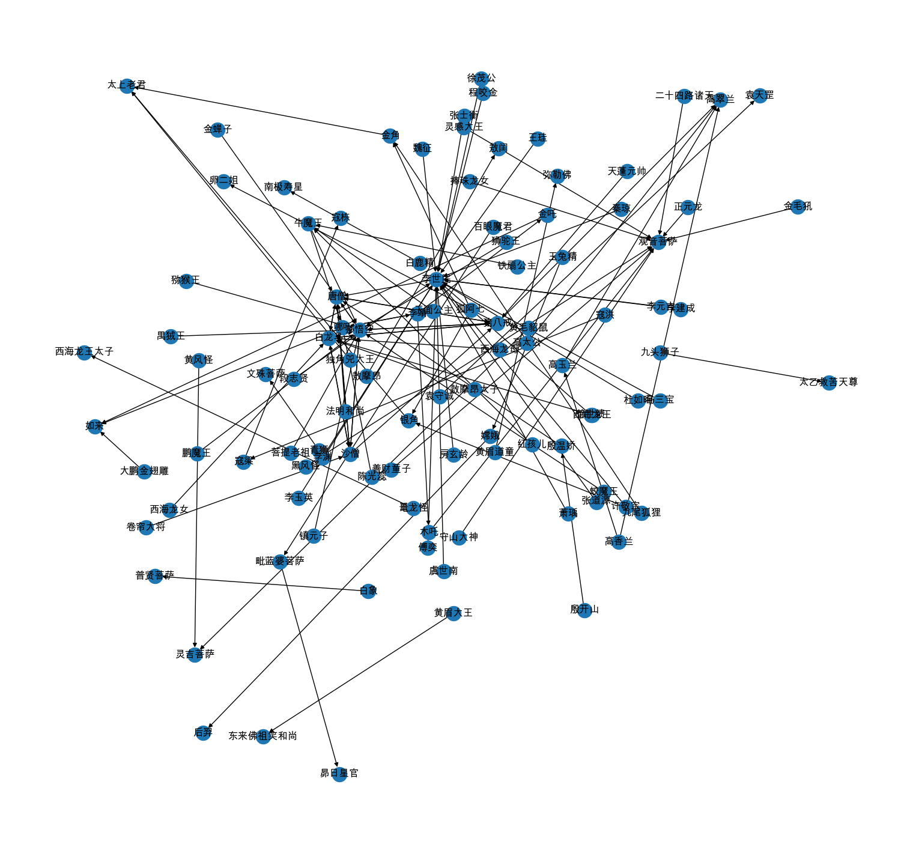
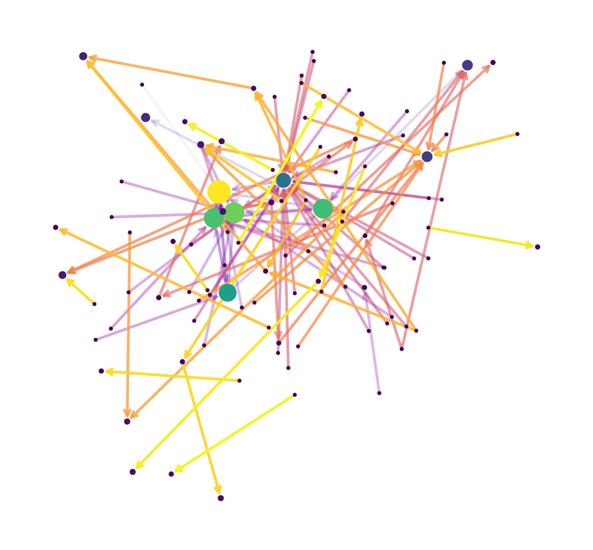

# Task06 PageRank算法
使用连接信息来计算图的节点重要度。
## 一、核心思想
对于一个有向图，每个节点具有in和out的连接，将进入节点的连接看作是投票，同时，来自重要节点的投票权重更高。

可以看出，这是一个递归问题。求解的思路为：

- 迭代求解线性方程组
- 迭代左乘M矩阵
- 矩阵的特征向量
- 随机游走
- 马尔可夫链

## 二、求解PageRank的方法
### 1.迭代求解线性方程组
1. 一个图中所有节点的pagerank之和为1，则初始化所有节点每个节点的重要度为 $\frac{1}{n}$ ，n为节点个数。
2. 设节点 $i$ 的重要度为 $r_i$ ，出度为 $d_i$ ，out的连接就代表了它对别的节点的投票，则每一条连接的投票重要度为 $\displaystyle \frac{r_i}{d_i}$ 。
3. 节点 $j$ 的重要度为所有入度连接的投票值之和 $\displaystyle r_j = \sum_{i \rightarrow j} \frac{r_i}{d_i}$ 。

注意，每个节点求出的结果都不用于当前这一轮的计算，用于下一轮计算。

### 2.迭代左乘M矩阵
就是将迭代求解线性方程组方法写成矩阵的形式，左乘重要度的矩阵。
1. 假设节点 $i$ 的出度为 $d_i$ ，则从节点 $i$ 指向节点 $j$ ，矩阵 $\displaystyle M_{ji} = \frac{1}{d}$ ，矩阵中i节点指向j节点的是第j行第i列，即 $M[j][i]$ ，该矩阵每列求和为1。
2. 迭代 $\vec{r} = M \cdot \vec{r}$ ， $\vec{r}$ 是各个节点的pagerank值的集合 。

### 3.矩阵的特征向量

首先介绍一下方阵、特征值和特征向量的意义。
#### a 方阵的意义
对于一个向量 $\vec{v}=[x,y]^T$ 来说，其意义就是 $\vec{v}=x\vec{i}+y\vec{j}$ ， $\vec{i}=[1,0]^T$ 和 $\vec{j}=[0,1]^T$ 是二维平面的一组基向量。则在经过线性变换后， $\text{变换后的}\vec{v}=x\cdot\text{变换后的}\vec{i}+y\cdot\text{变换后的}\vec{j}$ 。假如 $\vec{i}$ 和 $\vec{j}$ 变为了 $[-1,2]^T$ 和 $[3, 0]^T$ ，则 $\vec{v}=x[-1, 2]^T + y[3, 0]^T$ ，则这个变换可以表示成为矩阵： 

$$\left[
\begin{matrix}
-1 & 3 \\
2 & 0  \\
\end{matrix}
\right]$$

， $\vec{v} = M\cdot [\vec{i}, \vec{j}]$ 。 所以方阵的意义就是线性变换。对于一般的矩阵，好像不能完全这样理解，但是由于求特征值和特征向量的是方阵，所以这样最好理解。

#### b 特征值和特征向量
$A\vec{v}=\lambda\vec{v}$ ，则 $\vec{v}$ 就是矩阵A的特征值， $\lambda$ 就是矩阵A的特征向量。

实际的意义就是：一个向量在经过某种线性变换后，仅仅在长度上发生了变化，在方向上没发生变换。

### c pagerank中的矩阵特征向量方法
实际上是对迭代左乘M矩阵方法的改进，通过不断地迭代左乘M矩阵，会稳定收敛，即得到M矩阵的主特征向量。

收敛性：根据Perreon-Frobenius定理，对于Column Stochastic矩阵，最大的特征值为1，存在唯一的主特征向量（特征值1对应的特征向量），向量所有元素求和为1。

### 4.随机游走
每个节点被访问的次数越多，则证明其越重要。

1. 假设在 $t$ 时刻，一个用户访问了多个网页 $i$ （ $i_1,i_2,\cdots$ ）。
2. 在 $t+1$ 时刻，访问到网页 $j$ 的概率为 $\displaystyle r_j = \sum_{i \rightarrow j} \frac{r_i}{d_i}$ 。
3. 如果无限游走， $p(t)$ 可表示为网页 $i$ 的概率，这个概率表示用户在 $t$ 时刻访问网页 $i$ 的PageRank值。
4. 逐渐迭代，可以稳定收敛，即 $p(t+1) = M \cdot p(t) = p(t)$ 。

### 5.马尔可夫链
每个节点表示一种状态，节点之间的连接表示状态的转移，根据状态转移矩阵，可以计算下一个时刻的状态转移概率。

### 6.最终采用的方法
左乘M矩阵，便于计算机求解。

## 三、代码实战
```python
import networkx as nx # 图数据挖掘
import numpy as np # 数据分析
import pandas as pd
import random # 随机数
import matplotlib.pyplot as plt # 数据可视化
%matplotlib inline
plt.rcParams['font.sans-serif']=['Arial Unicode MS']  # 用来正常显示中文标签  
plt.rcParams['axes.unicode_minus']=False  # 用来正常显示负号
```


```python
df = pd.read_csv('data/西游记/triples.csv')
```


```python
df
```


<div>
<style scoped>
    .dataframe tbody tr th:only-of-type {
        vertical-align: middle;
    }

    .dataframe tbody tr th {
        vertical-align: top;
    }

    .dataframe thead th {
        text-align: right;
    }
</style>
<table border="1" class="dataframe">
  <thead>
    <tr style="text-align: right;">
      <th></th>
      <th>head</th>
      <th>tail</th>
      <th>relation</th>
      <th>label</th>
    </tr>
  </thead>
  <tbody>
    <tr>
      <th>0</th>
      <td>金蝉子</td>
      <td>唐僧</td>
      <td>past_life</td>
      <td>前世</td>
    </tr>
    <tr>
      <th>1</th>
      <td>孙悟空</td>
      <td>唐僧</td>
      <td>apprentice</td>
      <td>徒弟</td>
    </tr>
    <tr>
      <th>2</th>
      <td>猪八戒</td>
      <td>唐僧</td>
      <td>apprentice</td>
      <td>徒弟</td>
    </tr>
    <tr>
      <th>3</th>
      <td>沙僧</td>
      <td>唐僧</td>
      <td>apprentice</td>
      <td>徒弟</td>
    </tr>
    <tr>
      <th>4</th>
      <td>白龙马</td>
      <td>唐僧</td>
      <td>apprentice</td>
      <td>徒弟</td>
    </tr>
    <tr>
      <th>...</th>
      <td>...</td>
      <td>...</td>
      <td>...</td>
      <td>...</td>
    </tr>
    <tr>
      <th>104</th>
      <td>毗蓝婆菩萨</td>
      <td>昴日星官</td>
      <td>mother</td>
      <td>母亲</td>
    </tr>
    <tr>
      <th>105</th>
      <td>嫦娥</td>
      <td>后羿</td>
      <td>wife</td>
      <td>妻</td>
    </tr>
    <tr>
      <th>106</th>
      <td>敖摩昂</td>
      <td>敖闰</td>
      <td>son</td>
      <td>儿</td>
    </tr>
    <tr>
      <th>107</th>
      <td>哪吒</td>
      <td>李靖</td>
      <td>son</td>
      <td>儿</td>
    </tr>
    <tr>
      <th>108</th>
      <td>哪吒</td>
      <td>如来</td>
      <td>apprentice</td>
      <td>徒弟</td>
    </tr>
  </tbody>
</table>
<p>109 rows × 4 columns</p>
</div>


```python
edgs = [edge for edge in zip(df['head'], df['tail'])]
G = nx.DiGraph() # 有向图
G.add_edges_from(edgs)
```


```python
print(G)
```

    DiGraph with 104 nodes and 109 edges


```python
print(G.nodes)
print(len(G))
```

    ['金蝉子', '唐僧', '孙悟空', '猪八戒', '沙僧', '白龙马', '陈光蕊', '殷温娇', '法明和尚', '李世民', '殷开山', '菩提老祖', '镇元子', '牛魔王', '蛟魔王', '鹏魔王', '狮驼王', '猕猴王', '禺狨王', '天蓬元帅', '卵二姐', '高翠兰', '卷帘大将', '西海龙王', '西海龙母', '敖摩昂太子', '西海龙女', '李渊', '李建成', '李元吉', '王珪', '秦琼', '萧瑀', '傅奕', '魏征', '李玉英', '房玄龄', '杜如晦', '徐世绩', '徐茂公', '许敬宗', '马三宝', '段志贤', '程咬金', '虞世南', '张道源', '张士衡', '高太公', '高香兰', '高玉兰', '寇洪', '寇梁', '宼栋', '袁守诚', '袁天罡', '李靖', '木吒', '哪吒', '金吒', '正元龙', '观音菩萨', '二十四路诸天', '守山大神', '善财童子', '捧珠龙女', '如来', '红孩儿', '黑风怪', '黄风怪', '灵吉菩萨', '黄毛貂鼠', '金角', '太上老君', '银角', '铁扇公主', '九尾狐狸', '狐阿七', '鼍龙怪', '西海龙王太子', '灵感大王', '独角兕大王', '玉面公主', '金毛犼', '黄眉道童', '弥勒佛', '百眼魔君', '毗蓝婆菩萨', '青狮', '文殊菩萨', '白象', '普贤菩萨', '大鹏金翅雕', '九头狮子', '太乙救苦天尊', '玉兔精', '嫦娥', '白鹿精', '南极寿星', '黄眉大王', '东来佛祖笑和尚', '昴日星官', '后羿', '敖摩昂', '敖闰']
    104


```python
# 可视化
plt.figure(figsize=(15, 14))
pos = nx.spring_layout(G, iterations=3, seed=5)
nx.draw(G, pos, with_labels=True)
plt.show()
```


    

    


```python
# 计算节点重要度
pagearnk = nx.pagerank(G, # NetworkX graph有向图，如果是无向图则自动转为有向图
                       alpha=0.85, # Damping Factor，阻尼系数
                       personalization=None, # 是否开启personalization pagerank，即随机传送到指定节点集合的概率更高或者更低
                       max_iter=100, # 最大迭代次数
                       tol=1e-06, # 判定收敛的误差
                       nstart=None, #每个节点的初始pagerank值
                       dangling=None # dead end死胡同节点
                      )
```


```python
pagearnk
```


    {'金蝉子': 0.0028889203144616088,
     '唐僧': 0.13349105557884888,
     '孙悟空': 0.10498354112014094,
     '猪八戒': 0.09247797536009736,
     '沙僧': 0.07627154154696374,
     '白龙马': 0.09531260474698808,
     ...}


```python
sorted(pagearnk.items(), key=lambda x: x[1], reverse=True)
```


    [('唐僧', 0.13349105557884888),
     ('孙悟空', 0.10498354112014094),
     ('白龙马', 0.09531260474698808),
     ('猪八戒', 0.09247797536009736),
     ('沙僧', 0.07627154154696374),
     ('李世民', 0.052002919751408624),
     ('观音菩萨', 0.026625716774094633),
     ...]


```python
# 可视化
node_size = (np.array(list(pagearnk.values())) * 8000).astype(int) # 设置各个节点的尺寸
node_size
```


    array([  23, 1067,  839,  739,  610,  762,   23,   42,   23,  416,   23,
             23,   23,   82,   23,   23,   23,   23,   23,   23,  148,  206,
             23,   23,   23,   23,   23,   23,   23,   23,   23,   23,   23,
             23,   23,   23,   23,   23,   23,   23,   23,   23,   23,   23,
             23,   23,   23,   23,   23,   32,   23,   42,   59,   23,   42,
             54,   38,   73,   38,   23,  213,   23,   23,   23,   23,  106,
             23,   23,   23,   62,   23,   42,  115,   42,   23,   23,   23,
             23,   42,   23,   23,   23,   23,   23,   42,   23,   42,   23,
             42,   23,   42,   23,   23,   42,   23,   42,   23,   42,   23,
             42,   59,   59,   23,   42])


```python
# 节点颜色
M = G.number_of_edges()
edge_color = range(2, M + 2)
```


```python
plt.figure(figsize=(15, 14))
nodes = nx.draw_networkx_nodes(G, pos, node_size=node_size, node_color=node_size)
edgs = nx.draw_networkx_edges(
    G,
    pos,
    node_size=node_size, #节点尺寸
    arrowstyle='->', #箭头样式
    arrowsize=20, #箭头尺寸
    edge_color=edge_color, # 连接颜色
    edge_cmap=plt.cm.plasma, # 配色方案
    width=4 #连接线宽
)

# 设置每个连接的透明度
edge_alphas = [(5 + i) / (M + 4) for i in range(M)]
for i in range(M):
    edgs[i].set_alpha(edge_alphas[i])
    
ax = plt.gca()
ax.set_axis_off()
plt.show()
```


    

    


```python

```
